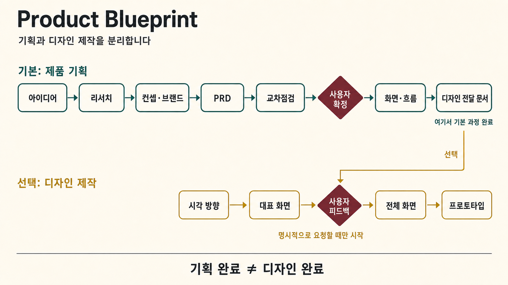

# Product Blueprint

아이디어를 **검토 가능한 제품 기획 패키지**로 만드는 Codex / Claude Code 플러그인입니다.

제품 컨셉, 브랜드 방향, PRD, 화면 역할과 흐름을 함께 정리하고 여러 관점에서 빠진 내용을 점검합니다. 기본 과정은 디자이너가 탐색을 시작할 수 있는 전달 문서에서 끝납니다. 완성 화면과 프로토타입은 자동으로 만들지 않습니다.



## 무엇을 해주나요?

- 아이디어와 레퍼런스를 바탕으로 서로 다른 제품 방향을 비교합니다.
- 포지셔닝, 이름의 방향, 말투와 브랜드 원칙을 제품 경험에 연결합니다.
- 첫 버전의 핵심 기능, 제외 범위, 사용자 흐름과 예외 상태를 PRD로 만듭니다.
- 제품전략·사용자근거·브랜드·PRD·실현성·리스크 관점에서 교차점검합니다.
- 주요 화면의 목적, 진입 경로, 행동, 상태와 복구 방식을 정리합니다.
- 디자이너가 바로 시각 탐색을 시작할 수 있는 `03-design-brief.md`를 만듭니다.

## 기본 진행 방식

1. 아이디어와 사용자를 짧게 정리합니다.
2. 제품 컨셉과 브랜드 방향을 비교하고 사용자가 선택합니다.
3. PRD를 작성한 뒤 여섯 관점으로 빠진 내용을 점검합니다.
4. 사용자가 첫 버전 범위와 제품 정의를 확정합니다.
5. 화면·흐름·상태를 정리하고 디자인 전달 문서를 만듭니다.

사용자가 직접 결정해야 하는 지점에서는 멈춥니다. 에이전트가 제품 방향이나 첫 버전 범위를 대신 승인하지 않습니다.

## 빠르게 시작하기

새 프로젝트에서 이렇게 요청하세요.

> product-blueprint로 러닝 기록·공유 모바일 웹앱을 기획해줘. 레퍼런스는 Strava야.

또는 스킬 이름을 직접 말할 수 있습니다.

> `product-blueprint:orchestrate`로 시작해줘.

작업 중에는 `00-review-dashboard.html`을 먼저 보면 됩니다. 지금 확인할 내용과 필요한 결정을 한곳에 모아 보여줍니다. 중단했다면 같은 폴더에서 “이어서 진행해”라고 요청하세요.

## 기획 깊이

| 모드 | 적합한 상황 | 결과 |
| --- | --- | --- |
| Lite | 빠르게 방향을 확인할 때 | 핵심 컨셉·브랜드·PRD·주요 흐름·디자인 전달 문서 |
| Standard | 실제 제품 기획의 기본값 | 근거와 교차점검을 포함한 전체 기획 패키지 |
| Deep | 규제·비용·운영 위험이 크거나 새로운 제품 | 더 넓은 근거, 예외 상황, 실현성과 리스크 검토 |

## 결과물

- 제품과 사용자를 설명하는 브리프
- 비교된 제품 컨셉과 선택된 브랜드 방향
- 첫 버전 범위와 제외 범위가 분명한 PRD
- 여섯 관점의 교차점검 결과
- 확정된 사용자·진입점·주요 여정
- 화면, 행동, 상태와 서비스 책임 정리
- 낮은 해상도의 흐름 보드
- 시각 디자인을 위한 전달 문서

이 결과는 좋은 제품 판단을 돕는 기획 기준선입니다. 시장성, 실제 사용자 수요, 상표 사용 가능성, 구현 성공을 보증하지는 않습니다.

## 디자인 제작은 선택 사항입니다

화면 디자인과 프로토타입은 기획과 분리되어 있습니다. 사용자가 명시적으로 원할 때만 다음처럼 시작합니다.

> `product-blueprint:design-production`으로 시각 디자인을 계속해줘.

이 과정은 곧바로 모든 화면을 만들지 않습니다. 먼저 2~3개의 시각 방향을 비교하고, 대표 화면 하나를 다듬어 사용자의 피드백을 받은 뒤 나머지 화면과 프로토타입으로 확장합니다.

전용 디자인 역량이나 충분한 레퍼런스가 없으면 그 한계를 밝힙니다. 생성된 화면을 곧바로 “완성된 디자인”으로 부르지 않습니다.

## 설치

### Claude Code

```text
/plugin marketplace add CodeAlpacat/product-blueprint-harness
/plugin install product-blueprint@product-blueprint-harness
```

### Codex

```bash
git clone https://github.com/CodeAlpacat/product-blueprint-harness.git
```

저장소를 Codex 플러그인으로 연결하면 `skills/` 아래 스킬이 발견됩니다.

## 더 자세한 문서

- [전체 기획 흐름](docs/workflow.md)
- [검증 방식과 명령](docs/validation.md)
- [선택형 디자인 제작 과정](docs/design-production.md)

## 저장소 구조

```text
assets/                          이미지와 템플릿
docs/                            사용자·운영 문서
references/                      품질과 계약 기준
scripts/init_prd_project.py      기획 폴더 만들기
scripts/validate_service_blueprint.py
skills/*/SKILL.md                단계별 작성·검토 스킬
tests/                           회귀 테스트
```

기본 흐름은 제품 기획과 디자인 전달 문서에서 멈춥니다. 기술 아키텍처와 구현 계획은 별도의 요청이 있을 때만 다룹니다.
